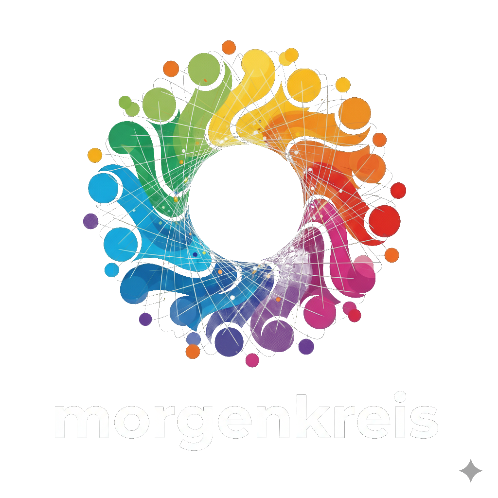

# morgenkreis



# Why is it called "morgenkreis" ?
(Reference: [Das Kita-Handbuch - Der Morgenkreis](https://www.kindergartenpaedagogik.de/fachartikel/beschaeftigungen-methoden/morgenkreis-ziele-durchfuehrung-sprachfoerderung/))

- A "Morgenkreis" (morning circle) is a daily ritual that provides structure, which in turn offers a sense of safety and familiarity. A regular morning circle with a consistent routine is important for providing security in the daily routine. Only when people feel safe can they relax and learn new things.


- The morning circle should be fun! It's easiest to learn when you're having fun.

### Key benefits of a "Morgenkreis"

- **It strengthens the community**: Through shared activities in the morning circle, people interact with each other, perceive one another, and experience themselves as a group.


- **It teaches social skills**: This includes listening, paying attention to each other, doing things together, and experiencing interaction.


- **It boosts self-confidence**: Taking part in the morning circle can help build a person's self-esteem.


- **It helps with knowledge transfer**: New topics and ideas can be discussed and introduced during this time.

## Contributing

Morgenkreis is **free, open-source software** licensed under **AGPLv3**.

We welcome contributions and help from anyone who wants to improve the project.

## LICENSE

Copyright (c) 2024-2025 Stefan Pfeiffer

Licensed under GNU Affero General Public License as stated in the [LICENSE](LICENSE):

```text
Copyright (c) 2024-2025 Stefan Pfeiffer

This program is free software: you can redistribute it and/or modify it under
the terms of the GNU Affero General Public License as published by the Free
Software Foundation, either version 3 of the License, or (at your option) any
later version.

This program is distributed in the hope that it will be useful, but WITHOUT
ANY WARRANTY; without even the implied warranty of MERCHANTABILITY or FITNESS
FOR A PARTICULAR PURPOSE. See the GNU Affero General Public License for more
details.

You should have received a copy of the GNU Affero General Public License along
with this program. If not, see https://www.gnu.org/licenses/
```
